<div align="center">

# Xiaomi Fan Card

**Every control your fan actually supports, on one calm Lovelace card.**

Capability-aware. Five themes. Native visual editor. No telemetry.

[](https://github.com/mrwogu/xiaomi-smart-fan-card/actions/workflows/ci.yml)
[](https://github.com/mrwogu/xiaomi-smart-fan-card/actions/workflows/hacs.yml)
[](https://codecov.io/gh/mrwogu/xiaomi-smart-fan-card)
[](https://github.com/mrwogu/xiaomi-smart-fan-card/releases)

<a href="docs/media/two-columns-full-theme-auto-light.webp">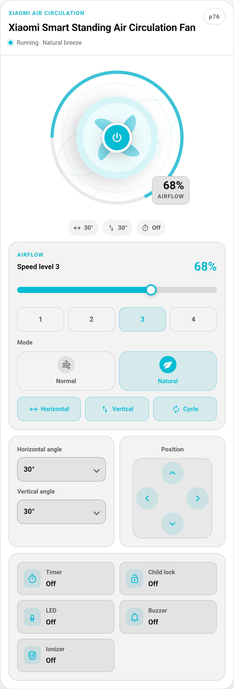</a>

<sub>Every screenshot is clickable and opens the full resolution capture.</sub>

[](https://my.home-assistant.io/redirect/hacs_repository/?repository=mrwogu%2Fxiaomi-smart-fan-card)

[Install](#install) · [Themes](#five-themes-one-card) · [Layouts](#layouts-that-fit-your-dashboard) ·
[Recipes](#recipes) · [Configuration](docs/configuration.md)

</div>

## Why you will like it

- **No dead buttons.** Controls appear only when your entity, its related
  entities, the model profile, or a registered service can actually perform the
  action. An unsupported fan gets a smaller card, not a broken one.
- **A real interface, not a wall of toggles.** Airflow graphic with a live speed
  ring, one slider, speed levels, modes, oscillation, angles, timer, and device
  extras, grouped the way you use them.
- **Five looks in one card.** Follow your Home Assistant theme, or switch to
  Mushroom, Minimal, Glass, or Industrial with a single option.
- **Fits every dashboard.** Sections and masonry sizing, comfortable or compact
  density, one or two control columns, configurable block order, and a layout
  that survives a 320 px column.
- **Accessible on purpose.** 44 px touch targets, keyboard focus rings, labelled
  status chips, screen-reader friendly details, reduced-motion and
  forced-colors support.
- **Private by design.** No telemetry, no analytics, no remote scripts, no
  direct device connection. Every action goes through Home Assistant.

## Five themes, one card

One option, `layout.theme`, changes the entire surface. Same entity, same
controls, same state.

The hero above is the auto theme in light mode. Below is the same card, same
state, in dark mode.

<table>
  <tr>
    <td align="center" width="50%">
      <a href="docs/media/two-columns-full-theme-auto.webp">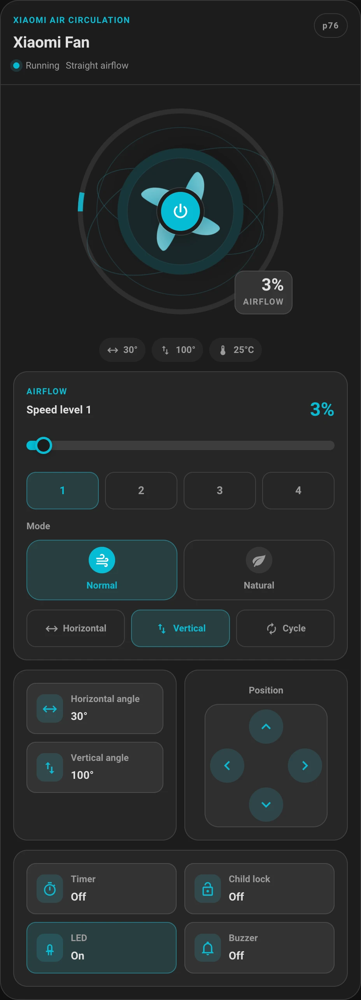</a><br>
      <strong>Auto</strong><br><code>layout.theme: auto</code><br>
      Inherits your Home Assistant colors, radius, and shadow.
    </td>
    <td align="center" width="50%">
      <a href="docs/media/two-columns-full-theme-mushroom.webp">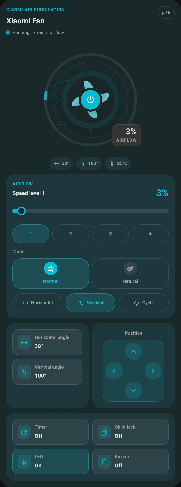</a><br>
      <strong>Mushroom</strong><br><code>layout.theme: mushroom</code><br>
      Soft panels and pill controls for Mushroom dashboards.
    </td>
  </tr>
  <tr>
    <td align="center" width="50%">
      <a href="docs/media/two-columns-full-theme-minimal.webp">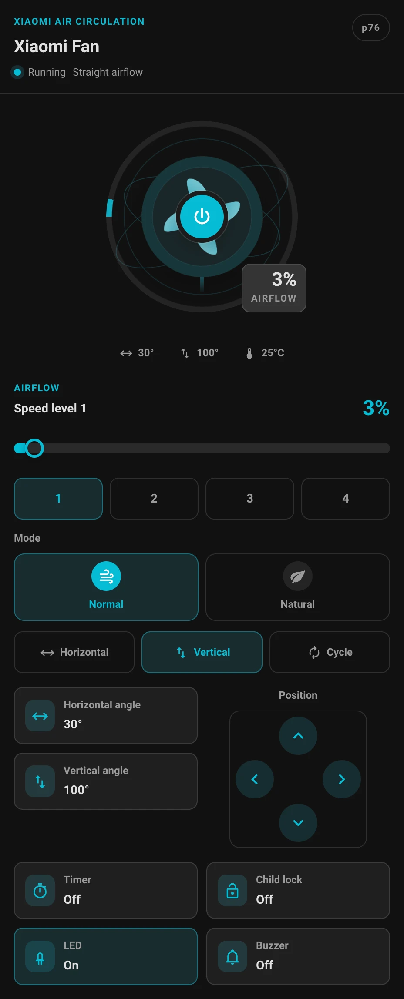</a><br>
      <strong>Minimal</strong><br><code>layout.theme: minimal</code><br>
      No chrome, no borders, content first.
    </td>
    <td align="center" width="50%">
      <a href="docs/media/two-columns-full-theme-glass.webp">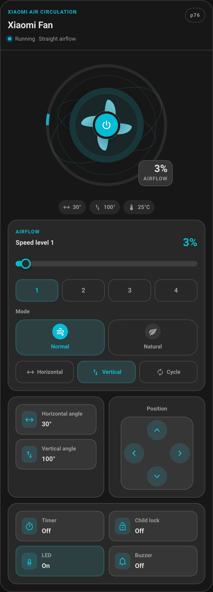</a><br>
      <strong>Glass</strong><br><code>layout.theme: glass</code><br>
      Translucent surface with backdrop blur.
    </td>
  </tr>
  <tr>
    <td align="center" colspan="2">
      <a href="docs/media/two-columns-full-theme-industrial.webp">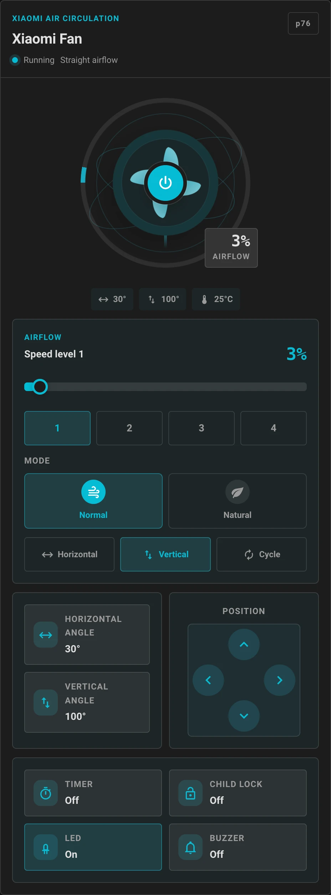</a><br>
      <strong>Industrial</strong><br><code>layout.theme: industrial</code><br>
      Technical labels, monospace metrics, amber accent.
    </td>
  </tr>
</table>

## Layouts that fit your dashboard

<table>
  <tr>
    <td align="center" width="50%">
      <a href="docs/media/layout-compact-side.webp">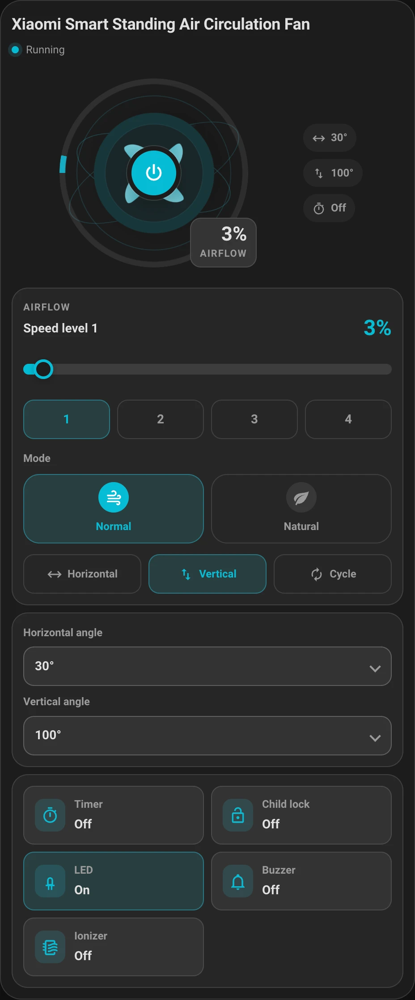</a><br>
      <strong>Information dense</strong><br>
      <code>density: compact</code> plus <code>details.position: side</code>
    </td>
    <td align="center" width="50%">
      <a href="docs/media/layout-tile.webp">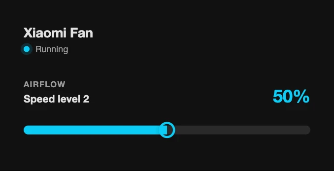</a><br>
      <strong>Status tile</strong><br>
      Name, status, speed. Nothing else.
    </td>
  </tr>
  <tr>
    <td align="center" width="50%">
      <a href="docs/media/layout-narrow.webp">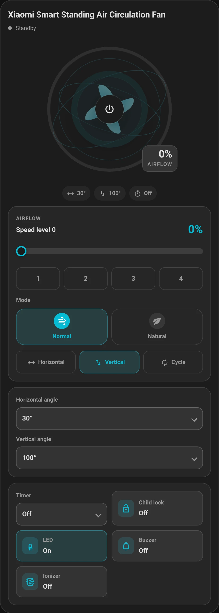</a><br>
      <strong>Narrow columns</strong><br>
      Container queries reflow the rows down to 320 px.
    </td>
    <td align="center" width="50%">
      <a href="docs/media/layout-order.webp">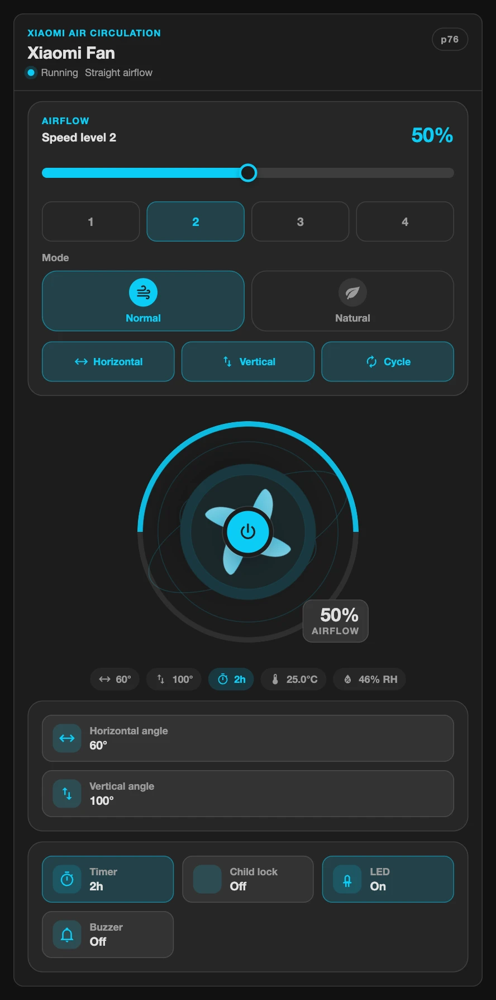</a><br>
      <strong>Your order</strong><br>
      <code>layout.order</code> moves header, visual, airflow, position, features.
    </td>
  </tr>
  <tr>
    <td align="center" colspan="2">
      <a href="docs/media/one-column-theme-auto.webp">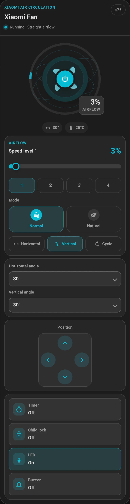</a><br>
      <strong>One control column</strong><br>
      <code>layout.columns: one</code> stacks every control group; the shots above
      use <code>two</code>.
    </td>
  </tr>
</table>

## Configure it by clicking

The visual editor is built on Home Assistant's own form schema: entity
selectors with domain filters, collapsible panels with icons, paired switches,
drag and drop block ordering, and helper text where an option needs it.

<div align="center">
  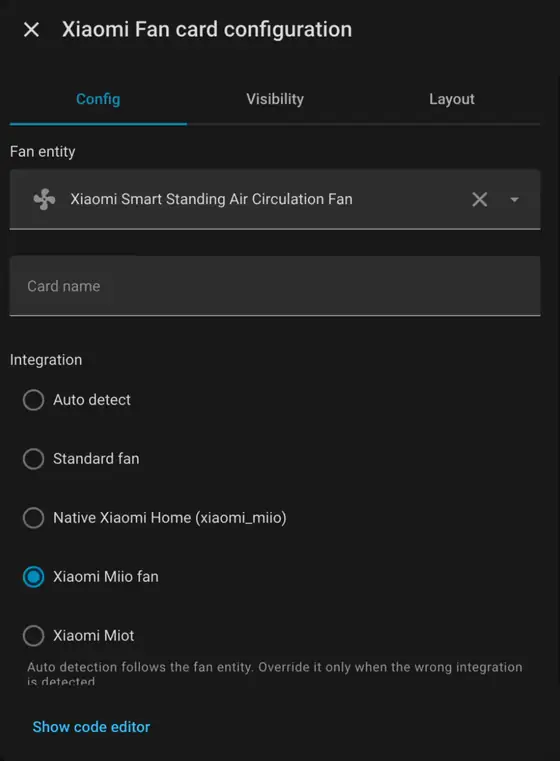
</div>

Panels group what belongs together: header, visual, controls with sub panels for
speed, modes, oscillation, angles and features, then details, layout, styles,
and related entities.

## See it move

<div align="center">
  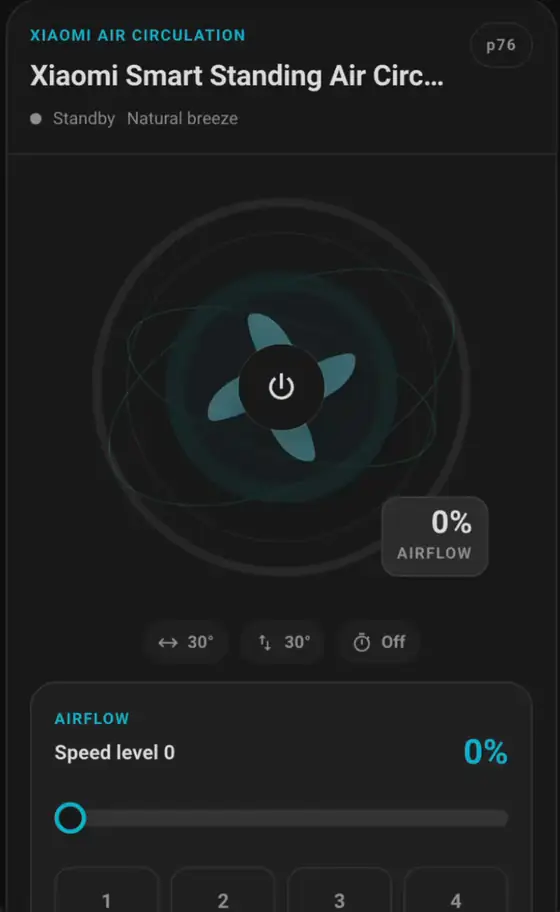
</div>

Slider feedback is immediate: the ring, the readout, and the level buttons
follow your finger and the service call fires when you let go. Decorative
motion stops completely under `prefers-reduced-motion`.

## Works with what you already have

| Integration      | Set `integration:` | What you get                                                                         |
| ---------------- | ------------------ | ------------------------------------------------------------------------------------ |
| Xiaomi Home      | `xiaomi_miio`      | Standard fan actions plus related switch, number, select, and sensor entities.       |
| syssi/xiaomi_fan | `xiaomi_miio_fan`  | Xiaomi services for angle, vertical oscillation, nudge, timer, LED, buzzer, ionizer. |
| Xiaomi MIOT      | `xiaomi_miot`      | Standard fan actions with related entity discovery.                                  |
| Any HA `fan`     | `standard`         | Percentage, presets, oscillation, direction, and whatever related entities exist.    |

`auto` keeps the card on standard fan actions and only uses custom Xiaomi
services when you select that integration explicitly.

<div align="center">
  <a href="docs/media/integration-standard.webp">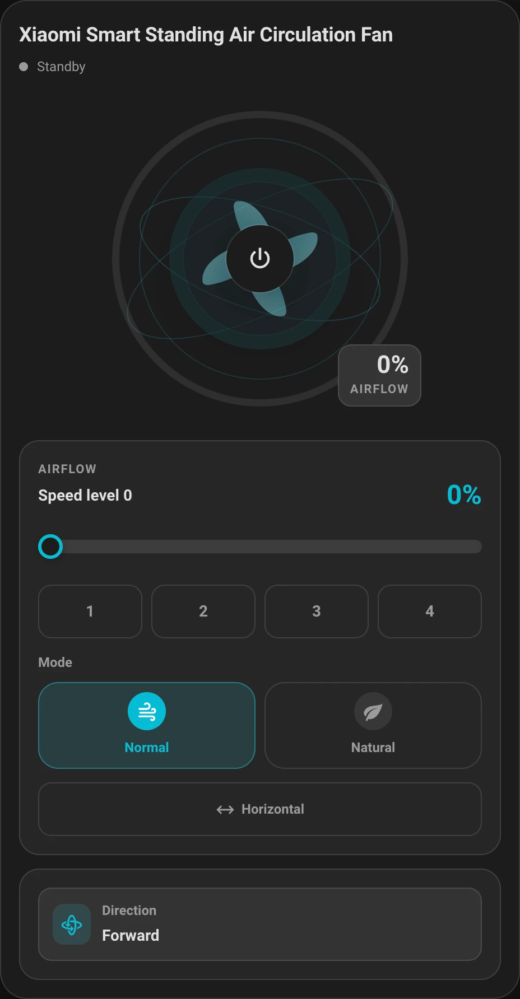</a><br>
  <em>A plain <code>fan</code> entity: fewer controls, still a finished card.</em>
</div>

### Feature coverage

- Airflow visualization with a live speed ring and reduced-motion support
- Speed slider with instant preview, plus model-specific speed levels
- Normal and Natural shortcuts, and a generic preset mode selector
- Horizontal and vertical oscillation with angle selectors or cycling
- Direction nudge controls and forward or reverse direction
- Timer, sleep preset, child lock, LED, buzzer, and ionizer when actionable
- Temperature and humidity from the fan or related sensors, in the sensor's own unit
- Favorite level from native Xiaomi `number` entities
- Known profiles for `zhimi.fan.*`, `dmaker.fan.*`, `xiaomi.fan.*`, and
  `leshow.fan.ss4`, including 1C, 2 Lite, P30, P43, P45, P70, P76, and P85
  families, with a safe fallback for everything else

Nudge arrows are hidden by default when angle controls exist, because both
target the same fan position. Set `controls.show_nudge_with_angles: true` to
show both.

<div align="center">
  <a href="docs/media/controls-nudge.webp">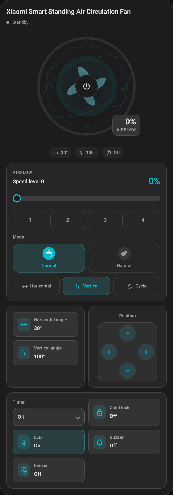</a><br>
  <em>Angle selectors and the position pad side by side.</em>
</div>

## Install

Requires Home Assistant **2024.8** or newer, because the visual editor uses
grouped `ha-form` sections.

1. Open **HACS** in Home Assistant.
2. Open **Frontend** and search for **Xiaomi Fan Card**.
3. Select the card and choose **Download**.
4. Reload the browser or restart Home Assistant if HACS asks you to.
5. Add a `custom:xiaomi-fan-card` card to a dashboard.

Before HACS approval, add `mrwogu/xiaomi-smart-fan-card` as a custom repository
with category **Dashboard**. The HACS backend calls this category `plugin`.

<details>
<summary>Manual resource registration</summary>

HACS normally registers the resource. If your installation requires manual
registration, add this module resource under **Settings > Dashboards >
Resources**:

```yaml
resources:
  - url: /hacsfiles/xiaomi-smart-fan-card/xiaomi-fan-card.js
    type: module
```

</details>

## Quick start

```yaml
type: custom:xiaomi-fan-card
entity: fan.xiaomi_smart_standing_fan
name: Living Room Fan
```

That is enough. Everything else is optional.

## Recipes

Copy any of these into a card and adjust the entity. Every option is documented
in [docs/configuration.md](docs/configuration.md).

**Showcase.** Full header, graphic, and every control group.

```yaml
type: custom:xiaomi-fan-card
entity: fan.living_room_fan
integration: xiaomi_miio_fan
layout:
  theme: auto
header:
  variant: full
```

**Information dense.** Compact controls with the details beside the graphic.

```yaml
type: custom:xiaomi-fan-card
entity: fan.living_room_fan
integration: xiaomi_miio_fan
layout:
  theme: auto
  density: compact
  columns: two
details:
  position: side
```

**Status tile.** Name, power, and speed only.

```yaml
type: custom:xiaomi-fan-card
entity: fan.living_room_fan
layout:
  theme: minimal
visual:
  show_graphic: false
  show_details: false
controls:
  show_speed_levels: false
  show_modes: false
  show_preset_mode: false
  show_horizontal_swing: false
  show_vertical_swing: false
  show_horizontal_angle: false
  show_vertical_angle: false
  show_nudge: false
  show_timer: false
```

**Your own styling.** Typed CSS tokens per block, no theme forking required.

```yaml
type: custom:xiaomi-fan-card
entity: fan.living_room_fan
styles:
  card:
    border: 1px solid rgba(120, 140, 180, 0.35)
    border_radius: 28px
  visual:
    size: 260px
  controls:
    height: 52px
```

## Configuration

Every option, default, and legacy alias is documented in
**[docs/configuration.md](docs/configuration.md)**. The most useful ones:

| Option                    | Values                                                              | Default       |
| ------------------------- | ------------------------------------------------------------------- | ------------- |
| `integration`             | `auto`, `standard`, `xiaomi_miio`, `xiaomi_miio_fan`, `xiaomi_miot` | `auto`        |
| `layout.theme`            | `auto`, `mushroom`, `minimal`, `glass`, `industrial`                | `auto`        |
| `layout.density`          | `comfortable`, `compact`                                            | `comfortable` |
| `layout.columns`          | `auto`, `one`, `two`                                                | `auto`        |
| `layout.order`            | any order of `header`, `visual`, `airflow`, `position`, `features`  | default order |
| `header.variant`          | `compact`, `full`                                                   | `compact`     |
| `details.position`        | `below`, `side`                                                     | `below`       |
| `controls.selection_mode` | `auto`, `buttons`, `select`                                         | `auto`        |
| `controls.timer_mode`     | `select`, `cycle`                                                   | `select`      |
| `controls.angle_mode`     | `select`, `cycle`                                                   | `select`      |
| `visual.animation`        | `auto`, `enabled`, `disabled`                                       | `auto`        |

Nested groups (`header`, `visual`, `controls`, `details`, `layout`, `styles`,
`related_entities`) take precedence over the legacy top-level flags, which
remain supported.

## Languages

The card and its visual editor follow `hass.language`. Regional codes such as
`pl-PL` use the base language, and unsupported languages fall back to English.

| Language | Code | Card UI | Visual editor |
| -------- | ---- | ------- | ------------- |
| English  | `en` | Yes     | Yes           |
| Polish   | `pl` | Yes     | Yes           |
| Spanish  | `es` | Yes     | Yes           |
| French   | `fr` | Yes     | Yes           |
| Italian  | `it` | Yes     | Yes           |

## Troubleshooting

<details>
<summary>The card is not available after HACS installation</summary>

Confirm that the resource URL uses the repository slug
`xiaomi-smart-fan-card`, then clear the browser cache or reload the Home
Assistant frontend. Check **Settings > Dashboards > Resources** for a module
resource ending in `xiaomi-fan-card.js`.

</details>

<details>
<summary>A control is missing</summary>

This is usually a capability decision, not a rendering failure. Check the
primary fan entity attributes, related device entities, and registered Home
Assistant services. If the integration does not expose the capability, the card
intentionally hides that control. See
[docs/compatibility.md](docs/compatibility.md).

</details>

<details>
<summary>The fan turns on but an optional action fails</summary>

Set the matching `integration` explicitly and verify the service is available in
**Developer Tools > Actions**. Include the integration name, Home Assistant
version, redacted entity attributes, card configuration, and exact reproduction
steps in a bug report.

</details>

## Support and community

This is a community HACS dashboard card, not an official Home Assistant
feature. See the [HACS publisher requirements](https://hacs.xyz/docs/publish/)
and the [custom card documentation](https://developers.home-assistant.io/docs/frontend/custom-ui/custom-card/).

- [Issues](https://github.com/mrwogu/xiaomi-smart-fan-card/issues) for reproducible bugs and feature proposals
- [Discussions](https://github.com/mrwogu/xiaomi-smart-fan-card/discussions) for project questions and ideas
- [Home Assistant Community](https://community.home-assistant.io/) for broader setup and integration help
- [Contributing guide](CONTRIBUTING.md), [security policy](SECURITY.md), [code of conduct](CODE_OF_CONDUCT.md)

When asking for help, redact tokens, hostnames, locations, private entity
names, device identifiers, and personal dashboard screenshots. A minimal
fixture beats a complete diagnostics export.

## Development

Requirements: Node.js 24 or newer and npm 11 or newer.

```bash
git clone https://github.com/mrwogu/xiaomi-smart-fan-card.git
cd xiaomi-smart-fan-card
npm ci
npm run validate
```

Useful commands:

```bash
npm test
npm run test:coverage
npm run build
prs validate --strict
prs compile
```

The production bundle is tracked for HACS at `dist/xiaomi-fan-card.js`. See
[CONTRIBUTING.md](CONTRIBUTING.md) for the workflow, Conventional Commits,
release automation, and generated PromptScript instructions.

Media lives in `docs/media` as WebP: still captures at their native width,
animations at 560 px and 10 fps. Recording sources stay local and are ignored by
git. Keep published media redacted: no tokens, hostnames, locations, device
identifiers, or personal dashboards.

## License

MIT
